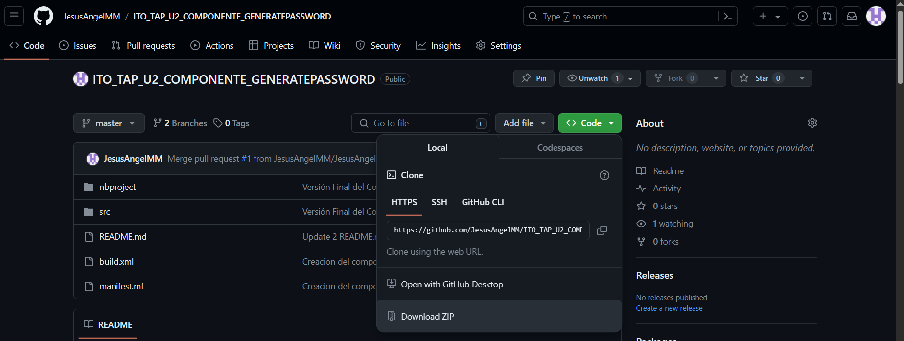
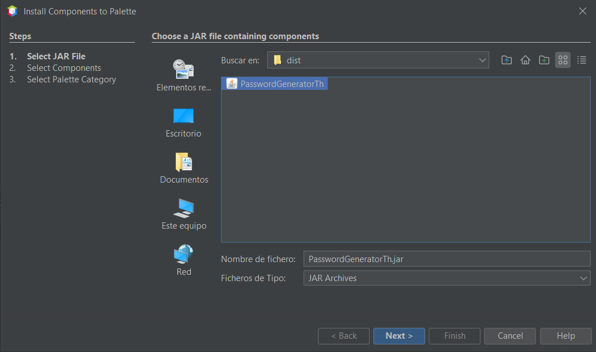
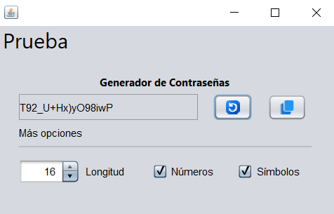
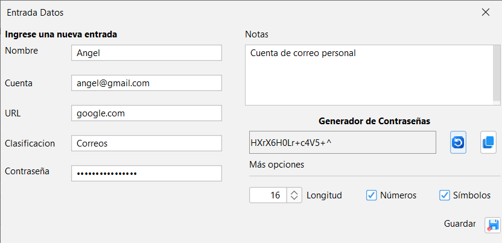

# Componente Generador de Contraseñas para Java

## Descripción
Este componente Java permite generar contraseñas seguras y aleatorias. Está diseñado para ser usado en aplicaciones Java Swing, pudiendo ser añadido fácilmente a `JFrame` o `JDialog`.

El componente desarrollado consta de dos clases principales, `SecurePasswordGenerator` y `GeneratePassword`, diseñadas para trabajar conjuntamente con el objetivo de generar contraseñas seguras y gestionar su interacción con el usuario a través de una interfaz gráfica.

## Usos
1. **Aplicaciones de Gestión de Usuarios**: El componente puede ser integrado en sistemas de gestión de usuarios donde se requiera la creación de contraseñas seguras para nuevos usuarios o para el reseteo de contraseñas existentes.
2. **Herramientas de Seguridad**: Podría ser utilizado como parte de una herramienta de seguridad más amplia que ofrezca funcionalidades como la gestión de contraseñas, auditorías de seguridad, o como un módulo en una suite de seguridad informática.
3. **Aplicaciones Web y Móviles**: Integración en aplicaciones web o móviles que requieran una alta seguridad en el manejo de contraseñas, como aplicaciones bancarias, comercio electrónico, o plataformas que manejen información sensible.
4. **Herramientas de Desarrollo de Software**: Como un plugin o extensión en entornos de desarrollo, ayudando a los desarrolladores a generar contraseñas seguras para uso en configuraciones de base de datos, archivos de configuración, y más.
El componente está diseñado para ser flexible y fácilmente integrable en diversas aplicaciones Java, proporcionando una solución robusta y segura para la generación de contraseñas que cumplan con criterios de seguridad actuales.

## Características
- Generación de contraseñas seguras y configurables.
- Fácil integración con cualquier componente Swing (`JFrame`, `JDialog`).
- Interfaz de arrastrar y soltar para una fácil manipulación en interfaces gráficas.
## Requisitos
- Java JDK 8 o superior.
- IDE con soporte para Swing si se desea visualizar el componente gráficamente (por ejemplo, NetBeans o IntelliJ IDEA).
## API
### SecurePasswordGenerator

#### Descripción
La clase `SecurePasswordGenerator` es responsable de generar contraseñas seguras basadas en parámetros específicos como longitud, inclusión de símbolos y números. Utiliza un enfoque aleatorio seguro para garantizar que las contraseñas generadas sean difíciles de predecir.

#### Campos
| Tipo | Campo | Descripción |
|------|-------|-------------|
| `String` | `LOWER` | Contiene las letras minúsculas de la A a la Z. |
| `String` | `UPPER` | Contiene las letras mayúsculas de la A a la Z. |
| `String` | `DIGITS` | Contiene los dígitos del 0 al 9. |
| `String` | `PUNCTUATION` | Contiene símbolos comunes utilizados en contraseñas. |

#### Métodos
| Nombre | Tipo de Dato que Retorna | Tipo de dato que recibe | Descripción |
|--------|--------|-------------------------|-------------|
| `SecurePasswordGenerator` | `String` | `int length, boolean includeSymbols, boolean includeNumbers` | Genera una contraseña segura basada en la longitud especificada y la inclusión opcional de símbolos y números. |

---

### GeneratePassword

#### Descripción
`GeneratePassword` es un componente GUI diseñado como un `JPanel` que permite a los usuarios generar contraseñas seguras visualmente. Incluye opciones para copiar la contraseña al portapapeles y transferir la contraseña a un campo de texto externo mediante el uso de métodos específicos.

#### Campos
| Tipo | Campo | Descripción |
|------|-------|-------------|
| `javax.swing.JTextField` | `externalTextField` | Campo de texto externo para recibir la contraseña generada. |

#### Constructores
| Constructor | Descripción |
|-------------|-------------|
| `GeneratePassword()` | Inicializa el componente, establece el tamaño y configura los modelos de los componentes del spinner. |

#### Métodos
| Nombre                    | Tipo de Dato que Retorna | Tipo de dato que recibe                    | Descripción                                                                                                |
| ------------------------- | ------------------------ | ------------------------------------------ | ---------------------------------------------------------------------------------------------------------- |
| `setExternalTextField`    | `void`                   | `javax.swing.JTextField externalTextField` | Establece el campo de texto externo donde se mostrará la contraseña generada.                              |
| `reset`                   | `void`                   |                                            | Limpia el texto mostrado en el etiquetado de contraseña, así como las opciones seleccionadas.              |
| `btnStartActionPerformed` | `void`                   | `java.awt.event.ActionEvent evt`           | Genera una nueva contraseña basada en las preferencias del usuario y actualiza el campo de texto asociado. |
| `btnCopyActionPerformed`  | `void`                   | `java.awt.event.ActionEvent evt`           | Copia la contraseña mostrada en el portapapeles del sistema.                                               |


## Instalación
Para utilizar este componente en tu proyecto, sigue estos pasos:

1. Obtener el repositorio
Clona con el siguiente comando

```bash
   git clone https://github.com/JesusAngelMM/ITO_TAP_U2_COMPONENTE_GENERATEPASSWORD.git
```

Otra opción es descargar `ZIP`.

2. Importa el proyecto en tu IDE preferido (NetBeans o VS code).
3. Asegúrate de que el proyecto se compila sin errores para crear el `.jar` según la versión de tu Java.

## Uso
1. Compila tu proyecto para crear el archivo `.jar`

Posteriormente presiona `SHIFT + F11`
2. Agrega el componente a tu paleta de componentes.
Da click derecho en la paleta y selecciona *Palette Manager* y selecciona *Add From Jar*

Navega hasta la carpeta *dist* del proyecto y selecciona el `.jar`.



3. Ya está listo para usar y arrastrar a tus componentes
s

4. Prueba ya sea en tu `JFrame` o `JDialog` funciona.


Ya puedes generar contraseñas seguras según tus necesidades.

Además puedes copiar y pegar la contraseña generada


>Recuerda que si quieres usar la contraseña en tu sistema principal, se obtiene a través del método

```Java
generatePassword.setExternalTextField(elemento_recibe);
```
Con esto puedes usar las contraseñas directamente en tu aplicación principal o sistema.



Por ejemplo en el programa anterior en el `actionPerformad`del botón se agregó lo siguiente

```Java
generatePassword1.setExternalTextField(txtDContrasena);
```

Que quiere decir *"lo que generó el componente `generatePassword` copialo en el componente `txtDContrasena`"*.

## Contribuir
Si deseas contribuir a este proyecto, por favor sigue los siguientes pasos:

1. Haz un fork del repositorio.
2. Crea una nueva rama para tu característica o corrección de errores.
3. Haz tus cambios.
4. Envía un pull request.


## Autores
- Diego García Jennifer - *Estudiante del ITO* - [Contacto]([JennyDiego (github.com)](https://github.com/JennyDiego))
- Jesús Ángel Martínez Mendoza - *Estudiante del ITO* - [Contacto]([JesusAngelMM (github.com)](https://github.com/JesusAngelMM))

## Agradecimientos
- Gracias a todos los que contribuyeron a este proyecto!
- Al café por quitarme el sueño.